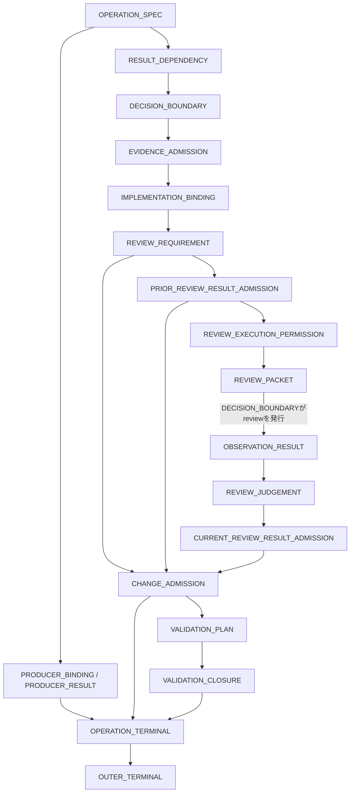

# C147直接基盤のreview制御再構成 Candidate194作成前設計

## 位置づけ

- 文書区分: 現行frontierの設計判断
- 直接基盤: Candidate147 `the-caption-3ce91a4-result-effect-scope-r1`
- 設計固定時のCandidate194: 未作成
- 後続状態: Candidate194作成済み。静的状態は[`実装監査`](candidate194-c147-direct-review-control-reconstruction-implementation-audit.md)を正本とする
- 評価profile: 未作成
- 評価run: 未発行
- 設計固定時の評価状態: 評価対象が存在せず、Candidateの`not_evaluated`状態にも未到達

この文書は、Candidate194の文面を作る前に、C147からC193までの証拠を使って制御責任、依存関係、試験経路、合否判定を固定する設計入力である。既存Candidate、保存済みresult、履歴文書の解釈をその場で書き換えるものではない。

## 結論

Candidate194を作る場合の親はC191でもC193でもなくC147とする。

C191からC193までで扱った問題は、review制御を後段へ追加すれば解ける問題ではなかった。C147は受領resultの効果範囲を扱ったが、次のoperationが何を消費し、どの先行resultに依存し、どのresultで発行可能になるかを十分に分離していない。そのため、review要否、review resultの利用可能性、変更許可、terminal判定を後から重ねるほど、開始identityとreadの交差、不要な逐次化、欠落観測の過剰依存、外側terminalの誤判定が生じた。

次案は「C191またはC193の拡張」ではなく、C147の各文を保持、分割、移動、置換のいずれかへ分類し、開始観測からreview、変更、検証、外側terminalまでを一つのoperation依存構造として再構成する。

後続Candidateは親ではなく、次の設計証拠として使う。

- C191: review実行、review result受領、変更後terminalが成立した経路
- C192: consumerとdependencyを別に判定すべきこと、および過剰依存の反例。抽象gate自体は継承しない
- C193: `DISPATCH_TRANSITION`の部分効果と、依存判定を独立責任にしない場合の失敗。`dispatch_candidate`、`predecessor`、`dispatch_frontier`は継承しない

## 対象と非対象

対象は、C147原文の責任分解、開始identityから外側terminalまでの依存関係、Standard14とADR9の実際のTaskSpecに基づく発行経路、品質・機構判定、失敗時の停止条件である。

次は対象外とする。

- Candidate194のprompt bundle、descriptor、profile、set、rating contractの作成
- 評価slotの発行
- C191、C192、C193の履歴artifactの改訂
- repository外のexecutor、tool adapter、runtime hookによる強制
- release、採用、projection、本体反映

## 固定する直接基盤

| 項目 | identity |
|---|---|
| prompt | `the-caption-3ce91a4-result-effect-scope-r1` |
| prompt file | `prompts/candidates/the-caption-3ce91a4-result-effect-scope-r1/files/AGENTS.md.txt` |
| bundle SHA-256 | `51b0395d2a82b90e12b4d457d441c43a899577128cfa887c454618c9d2e0a5cc` |
| target commit | `3ce91a403f9e0c83f29d56bbe9e7b449b713445d` |
| target tree | `88eecfa29f7016b4d77061d3aabe3e7d176fea9b` |

この固定はCandidate194の比較基準や評価profileを作成したことを意味しない。ここで固定するのは設計上の直接基盤だけである。

## 保存済み証拠から確定した問題

### C147のADR9証拠

`evaluations/results/candidate147-result-effect-scope-adr9-r2-n50-audit-r1.json`では450件がvalidだった一方、Score 4は161件、Score 1は289件だった。validであることは、review制御の品質または機構が成立したことを意味しない。

| 観測 | 件数または状態 | 設計上の意味 |
|---|---:|---|
| ADR01、ADR02の不要review | 66件 | review要否の独立判定が必要 |
| ADR03からADR06で期待した`blocked`に対する`unavailable` | 196件 | missingや非valueを一律にterminalへ使っている |
| ADR03からADR06で正しく`blocked` | 4件 | 期待経路は存在するが安定しない |
| ADR06の禁止canary参照 | 4件 | review packetとallowed readの境界が不足 |
| ADR07の誤った`blocked` | 2件 | positive applicabilityとreview完了の接続が不足 |
| ADR09でreview未開始 | 25件 | review実行許可と外側terminalが混線 |
| 危険な変更 | 0件 | C147の安全停止は保持すべき強み |

C147のtraceには、ADR9の開始文が無限定の「不一致なら停止する」であるにもかかわらず、開始identityの観測と設計readを同じmodel responseで発行した例もある。後続review gateを足すのではなく、C147の`DECISION_BOUNDARY`を開始時点から再構成する必要がある。

### C191の証拠

C191はADR9で45/45、Standard14で70/70の品質判定を成立させ、reviewとterminalの基本経路が実装可能であることを示した。一方、Standard14の保存済み再評価では対象9ケース中44/45で余分なstepが観測された。

この「9ケース」はtrace stepの影響集合であり、TaskSpecの意味に基づくdispatch oracleではない。A01とF10 entrypoint inventoryを含む一方、同時発行可能なF04とF06を含んでいない。保存済みの`affected9`や総token差分は数値証拠として保持するが、その集合を次案の正解経路へ流用しない。

### C193の証拠

C193の`DISPATCH_TRANSITION`は、ADR9の開始identityとreadの交差をC191の36/45から28/45へ減らした。しかし正しい経路は17/45にとどまった。

品質失敗も各1件残った。

- ADR05ではcertificate外のmissingを依存対象にして過剰に停止した。
- ADR06では要求fieldとは異なるfieldを見て、必要なvalueを取得せず判定した。

transitionの追加だけではconsumer、requested result contract、dependency atom、terminalを分離できない。

## 試験TaskSpecから導く正しい発行経路

保存済みtraceの発行形ではなく、各ケースのTaskSpecがどのoperation classを停止対象にするかを正本とする。

### Standard14

#### 開始identityを発行しないケース

| ケース | 理由 | 正しい初動 |
|---|---|---|
| A01 | 実装operationは`spec_ready=false`で、開始identity resultを消費する後続operationがない | 実装operationのproducer、read、edit、testを開始せず、別のclarification operationから未固定required outcomeだけを一度質問する |

#### 開始identityと許可済みreadを同時発行できるケース

A02、F01、F02、F03、F04、F06、F07 canonical、F07 dependency、F08では、drift時の停止対象がartifact変更またはrequired validationであり、read自体を禁止せず、read targetやpermissionもidentity resultで変わらない。

これらでは開始identityと独立readを同じmodel responseから個別invocationとして発行する。開始identityだけを先に発行し、次のmodel stepまで待つことは不要な逐次化である。

#### 開始identityを先に確定するケース

| ケース | TaskSpec上の停止範囲 | 正しい経路 |
|---|---|---|
| F05 clarify | 追加operationを停止 | identityを先に確定し、一致後に質問へ進む |
| F05 out-of-scope | 後続operationを停止 | identityを先に確定し、一致後に範囲外判定へ進む |
| F10 entrypoint inventory | drift時は調査せず停止 | identityを先に確定し、一致後にinventory readへ進む |
| F10 monthly review | drift時はreviewを開始せず停止 | identityとseed存在確認は同時発行できるが、review readは一致確認後に発行する |

### ADR9

ADR9の全ケースは、model-visibleな開始文が無限定に「不一致なら停止する」と定める。開始identityは、すべての設計read、review read、変更前evidenceより先に単独で確定しなければならない。

| ケース | review | 期待result | 変更 | 外側terminal |
|---|---|---|---|---|
| ADR01 | `not_required` | reviewなし | あり | `completion_ready` |
| ADR02 | `not_required` | reviewなし | あり | `completion_ready` |
| ADR03 | `required` | counterexample | なし | `blocked` |
| ADR04 | `required` | counterexample | なし | `blocked` |
| ADR05 | `required` | counterexample | なし | `blocked` |
| ADR06 | `required` | counterexample | なし | `blocked` |
| ADR07 | `required` | `no_counterexample_found` | あり | `completion_ready` |
| ADR08 | prior resultはinadmissible、review実行permissionなし | reviewを起動しない | なし | `unavailable` |
| ADR09 | `required` | required atomのmissing | なし | `unavailable` |

ADR05ではpaired-scope certificateに含まれないmissingはreview resultを失効させない。ADR06では`positive_applicability_predicate`の正確なfieldだけを対象とし、履歴canaryは参照しない。ADR07はreview不要ではなく、reviewが必要で、反例なしを受領してから変更へ進む。

### model-visible TaskSpecの直接照合

上記経路は、評価結果の要約ではなく、次のmodel-visible入力を直接照合して固定した。

- Standard14: `evaluations/sets/the-caption-standard14-r1/README.md`が固定する14 case revisionの各`trial-prompt-input.json`
- ADR9: `evaluations/sets/the-caption-preimplementation-adversarial-design-review-r2/README.md`と、ADR01からADR09の`adversarial-design-review-r2/trial-prompt-input.json`

照合結果は次のとおりである。

- Standard14の14ケースは、開始identity resultにconsumerがないA01、readと同時発行できる9ケース、開始identityを先に確定する4ケースへ重複なく分類できる。
- ADR9の9ケースはすべて、無限定の「不一致なら停止する」を持つため、開始identityだけを最初の発行集合にする。
- F10 monthlyの固定seed存在確認は開始identity operationの一部であり、設計readまたは独立reviewではない。`pwd`、branch、HEAD、status、`git cat-file -e`は同じ開始発行集合へ置ける。
- ADR9の独立reviewでは、review producerへ渡すpacketを起動前に固定する。packetが要求する観測targetの`missing`は、packet形成失敗ではなく、起動後に返る観測resultである。

したがって23ケースの開始経路に未分類ケースはない。ただし、この分類だけではCandidateの文面が挙動を一意に拘束するとは扱わず、評価時にはtrace上の実発行集合を機構predicateとして検査する。

A01のprivate quality oracleは「必要な範囲のreadだけ」を許容し、tool invocation 0件自体を品質条件にはしていない。一方、この再構成では、未固定required outcomeを変えない開始identityにconsumerがないため、そのidentity invocationを0件とすることを追加の機構predicateにする。既存quality oracleと新しい機構predicateを同じ条件として扱わない。

## TaskSpecだけでは足りない理由

TaskSpecは成果、開始条件、禁止事項、期待terminalをケースごとに定めるが、次の共通制御までは重複して規定しない。

- resultを消費するoperationがないときに観測を発行しないこと
- 先行resultが次のtarget、permission、method、stop condition、requested result contract、発行可否のどれを変え得るか
- 独立invocationを同時発行する条件
- missing、unreadable、terminal failure、観測valueの区別
- review要否、review実行permission、review result admission、変更permissionの分離
- operation terminalと依頼全体のterminalの分離

これらをprompt側の共通実行規律としてC147から再構成する。

## C147原文の移行方針

番号はC147原文の条項内文を上から分けた設計参照番号であり、既存artifactへ新番号を付与するものではない。

| C147範囲 | 扱い | 移行先または理由 |
|---|---|---|
| 01.01 | 拡張 | operation specへconsumer、result kind、dependency、terminalを追加 |
| 01.02–01.05 | 保持 | required outcomeとimplementation choiceの分離を維持 |
| 01.06 | 拡張 | consumerがある開始観測だけを許可 |
| 01.07 | 分割 | operation内result bindingと外側terminalを分離 |
| 02.01–02.03、02.05 | 保持 | producer identityの単一bindingと変更時失効を維持 |
| 02.04 | 移動 | owner語列とproducer指定の違いを`OWNER_ROLE`へ集約 |
| 03.01–03.02 | 保持 | operation terminalの根拠として維持 |
| 04.01–04.03 | 保持 | worker packetとcontext最小化を維持 |
| 05.01–05.05 | 再配置 | repository evidenceのadmissionへ集約 |
| 05.06 | 統合 | 重複するdefault denyを一つにする |
| 05.07 | 拡張 | stateだけでなくconsumerとrequested resultを要求 |
| 05.08–05.11 | 再配置 | implementation bindingへ集約 |
| 05.12 | 置換 | 直接変更ではなくreview admissionとchange admissionを通す |
| 05.13 | 移動 | 変更後validationはvalidation planだけが発行する |
| 05.14–05.15 | 保持 | 追加evidenceの開放条件を維持 |
| 06.01 | 保持 | criterion ownerはnon-machine riskの担当情報 |
| 06.02 | 分割 | generic producer指定とreview applicabilityを分離 |
| 06.03–06.05 | 保持 | producer resultのidentity証跡を維持 |
| 06.06 | 移動 | result dependencyへ移す |
| 06.07 | 分割 | rootの補完禁止とproducer resultを分離 |
| 07.01 | 保持 | root非producer時の禁止を維持 |
| 08.01–08.02 | 置換 | 固定先行artifactではなくdependency atomで表す |
| 09.01–09.03 | 保持・拡張 | result effectと独立invocationの同時発行を維持 |
| 09.04–09.06 | 置換 | 限定停止と無限定停止をTaskSpecの語義どおりに扱う |
| 10全体、11全体 | 保持 | validation closureとvalidation planを維持 |
| 12.01–12.03、12.05 | 保持 | method選択と禁止回避不可を維持 |
| 12.04 | 分割 | invocation failureとpermission denialを別stateにする |
| 13全体 | 保持・拡張 | recoveryを維持し、review result再生成を禁止 |

C147の不変条件は削除しない。重複を統合し、owner、consumer、失効条件、terminalのいずれかが異なる責任だけを分ける。

## 再構成する24責任

1. `OPERATION_SPEC`
2. `PRODUCER_BINDING`
3. `PRODUCER_RESULT`
4. `OWNER_ROLE`
5. `ROOT`
6. `WORKER_CONTEXT`
7. `RESULT_DEPENDENCY`
8. `METHOD`
9. `RECOVERY`
10. `EVIDENCE_ADMISSION`
11. `DECISION_BOUNDARY`
12. `IMPLEMENTATION_BINDING`
13. `REVIEW_REQUIREMENT`
14. `PRIOR_REVIEW_RESULT_ADMISSION`
15. `REVIEW_EXECUTION_PERMISSION`
16. `REVIEW_PACKET`
17. `OBSERVATION_RESULT`
18. `REVIEW_JUDGEMENT`
19. `CURRENT_REVIEW_RESULT_ADMISSION`
20. `CHANGE_ADMISSION`
21. `VALIDATION_PLAN`
22. `VALIDATION_CLOSURE`
23. `OPERATION_TERMINAL`
24. `OUTER_TERMINAL`

この順序は実行を常に直列化する順序ではない。各責任が何を所有し、どのresultを消費するかを定義する順序である。

## 責任ごとの設計契約

### `OPERATION_SPEC`から`WORKER_CONTEXT`

- `OPERATION_SPEC`: predicate、owner、permission、constraint、requested result kind、consumer、dependency、terminal conditionを実行前に固定する。実装operationが`spec_ready=false`なら、そのoperationのproducer binding、predicate、read、変更、testを開始しない。未固定required outcomeを直接示す一度の質問は、`clarification`という別operation identityへbindし、root producer、質問対象、禁止operation、terminal resultを固定してから返す。開始identityはconsumerがある場合だけ観測する。
- `PRODUCER_BINDING`: 一operationへ一producer identityを初回predicate前にbindし、再割当てしない。変更時は旧bindingを失効させる。
- `PRODUCER_RESULT`: bind済みproducerのterminal resultがrequested result contractを満たす場合だけ利用可能とする。起動、wait、root説明、異Sender messageは代用しない。
- `OWNER_ROLE`: owner語列は担当情報でありproducer指定ではない。独立review producerはTaskSpecが直接要求した場合だけ起動する。
- `ROOT`: rootがproducerでないoperationではpacket構築、result binding、依存集約だけを行い、predicateやreview判断を再生成しない。
- `WORKER_CONTEXT`: criterion、owner、pass condition、TaskSpec範囲、target、scoped diffまたはresult、required evidence、allowed read、forbidden inputを固定する。

### `RESULT_DEPENDENCY`から`IMPLEMENTATION_BINDING`

- `RESULT_DEPENDENCY`: 先行resultが次のtarget、permission、method、stop condition、requested result contract、発行可否、terminal conditionを変え得る場合だけdependencyをbindする。実際に消費するatomに限定し、certificate外missingや無関係fieldを含めない。artifact変更、追加観測、失敗resultは、入力atomが変わったresultだけを失効できる。terminal operationのresultが失効しても同じoperationを再開せず、許可される場合だけ新しいoperation identityを作る。
- `METHOD`: TaskSpec明示手段だけを固定し、未固定手段はpredicateを変えずpermission内で選ぶ。invocation failure、permission denial、明示禁止を別stateにする。
- `RECOVERY`: environment-only repairと同じrequired command再実行を一組にする。review judgementや独立producer resultをrootが再生成しない。
- `EVIDENCE_ADMISSION`: repository evidenceはdefault denyとし、未観測predicate、欠けた観測値、requested result、consumerがbind済みで、そのevidenceがconsumer stateを変え得る場合だけ発行する。変更後validationは発行しない。
- `DECISION_BOUNDARY`: 各変更前invocationのrequested result、consumer、class、target、permission、method、stop conditionを発行前に固定する。consumerがなければ発行しない。限定停止は名前を挙げたclassだけ、無限定停止は全未発行classへ適用する。相互非依存でreadyなinvocationは同じmodel responseから個別tool callとして全件発行し、発行集合とtool-call identity集合を一対一にする。明示された同時発行上限を超える場合だけ、固定順序と上限で現在集合を事前分割し、result受領後に便宜的に選び直さない。発行済み集合の一件がcell ID付きnonterminal resultを返した場合、その集合をnonterminalのまま保持し、同じcell IDへのwait以外を追加発行しない。全件のterminal resultを受領後に一度だけ判断する。独立review producerの実発行もこの責任が所有し、`required`、admissible prior resultなし、execution permission allowed、packet readyがそろった場合だけ発行する。post-change validationは所有しない。
- `IMPLEMENTATION_BINDING`: target artifact、適用中instruction、required change effect、artifact relation、保持constraintを一つの実行可能な変更predicateへbindする。repository evidenceで未固定required outcomeを補完しない。

### review制御

- この節が扱うのは、artifact変更のadmissionに必要な「入れ子の独立review operation」である。F10 monthlyのように依頼自体が`task_kind=non-destructive-review`でproducerがrootのoperationへ、独立reviewの要否判定やreview producer起動を重ねない。その場合は依頼本体を通常の`OPERATION_SPEC`、`PRODUCER_BINDING`、`EVIDENCE_ADMISSION`、`OPERATION_TERMINAL`で扱う。
- `REVIEW_REQUIREMENT`: applicabilityを`not_applicable | not_required | required`としてTaskSpecの有限な直接条件へbindする。独立review controlを適用するのは、TaskSpecまたは適用中authorityがcriterion、allowed result kind、consumer、independenceを直接固定したsubjectだけとする。review契約非適用の通常変更、primary review task、owner語列、単語類似、慣行から独立reviewを新設しない。`not_required`は、既存machine-bound resultだけで全effect、constraint、relationを直接照合できる有限閉包に限る。
- `PRIOR_REVIEW_RESULT_ADMISSION`: 保存済みresultはTaskSpecが許可し、target、predicate、input identity、producer、freshnessが一致する場合だけ使う。利用不可は現在reviewの起動permissionを与えない。
- `REVIEW_EXECUTION_PERMISSION`: 新規の独立review実行が`allowed | denied`のどちらかを判定するだけとし、producerを起動しない。permission denialはprior resultを失効させず、packet unreadinessやreview result failureとも混同しない。
- `REVIEW_PACKET`: `required`でadmissible prior resultがなく、execution permissionがallowedの場合に、review target、predicate、観測field、certificate scope、pass condition、allowed read、forbidden inputをproducer起動前に正確に固定する。target identity未固定はpacket unavailableとするが、固定targetの現在値が未観測またはmissingになり得ることはpacket readinessを妨げない。履歴canary、非公開oracle、期待terminal、rootの推測、review開始後diffを含めない。packet ready後の起動は`DECISION_BOUNDARY`へ委ねる。
- `OBSERVATION_RESULT`: atomを`value | missing | unreadable | terminal_failure`に分け、field identityとinvocation result contract identityとともに保存する。aggregate non-success下のper-item valueは、適用中contractがそのvalueの真正性を明示する場合だけadmitし、未固定なら別invocationを要求する。異なるfieldのvalueを代用しない。
- `REVIEW_JUDGEMENT`: counterexampleは実際に使ったatomだけへ依存する。`no_counterexample_found`はmanifestの全要求atomがvalueの場合だけ、`unavailable`は未解決predicateに関係する要求atomが非valueの場合だけ成立する。
- `CURRENT_REVIEW_RESULT_ADMISSION`: producer、target、predicate、input identity、terminal、requested result contractを照合し、失敗をrootが補完しない。
- `CHANGE_ADMISSION`: required reviewがないか、admissible review resultが許可した場合だけ変更する。coupled subjectでは全subjectのallowと保持relationがそろうまで変更せず、変更が分離不能なら一部だけを変更しない。counterexample、unavailable、permission denial、inadmissible resultでは変更しない。

### validationとterminal

- `VALIDATION_PLAN`: 変更後、required validationと完了判定に必要なdiff、statusを一つの実行票へ順にbindする。未指定commandは既受領のTaskSpec、instruction、target evidenceから選ぶ。
- `VALIDATION_CLOSURE`: required validationを個別invocationとして順に発行し、各resultを個別bindする。失敗またはunavailableなら後続を発行しない。全success後に追加readを足さない。
- `OPERATION_TERMINAL`: 当該predicateに必要なproducer resultがterminalで、bind済みresultがそのoperationのterminal conditionを満たした場合だけterminalにする。clarification operationは一度の質問resultでterminalになるが、未固定の実装operationを完了済みにしない。
- `OUTER_TERMINAL`: 全required operationがterminalで、未解決dependencyがなく、TaskSpecの最終状態を説明できる場合だけ依頼全体をterminalにする。TaskSpecがclarificationをsingle terminal outcomeとする場合は、terminalになったclarification operationと未発行の実装operationから`clarification_required`を返す。`completion_ready`、`blocked`、`unavailable`も原因とともに集約する。

## 主要な依存関係

`OWNER_ROLE`、`ROOT`、`WORKER_CONTEXT`、`METHOD`、`RECOVERY`は、該当operationの発行制約として横断適用する。

## 重複と参照の監査条件

- 開始identityの同時発行規則は`DECISION_BOUNDARY`だけが所有する。
- repository evidenceの開放条件は`EVIDENCE_ADMISSION`だけが所有する。
- review要否、prior result利用、review起動permission、current result利用、変更permissionを一つのgateへ畳み込まない。
- `REVIEW_PACKET`をreview producer起動後に作らず、観測targetの現在値をpacket readinessへ混ぜない。
- 依頼本体のroot reviewと、変更admission用の独立review operationを同じreview gateへ入れない。
- terminal review resultのdependency atomが変わった場合は旧resultを失効させるが、同じoperationを再開しない。TaskSpecが再reviewを許す場合だけ、新しいoperation、packet、producer、result identityを作る。
- aggregate invocationの失敗を個別atomの一括失効へ使わず、invocation result contractが保証したatomだけを保持する。
- readyな発行集合の一部だけを発行して残りを次のmodel responseへ送らず、cell ID付きnonterminal resultを別operationで迂回しない。

## M3方向review

### review operation

- operation identity: `candidate194-c147-direct-reconstruction-m3-direction-review`
- producer: root
- criterion: 24責任設計を一般入力で成立不能にし、target、permission、methodまたはstop conditionの変更を必要とする具体的反例があるか
- pass condition: 全確認状態が既存24責任内で一意に導出でき、未解決blocking counterexampleが0件
- allowed input: C147原文、C147からC193の保存済み原因証拠、model-visible Standard14・ADR9 TaskSpec、既存M3の具体的反例
- forbidden input: Candidate194本文、評価後の修正、private oracleのmodel-visible入力への追加、新しい評価系列
- 独立producer: TaskSpecが要求していないため起動しない

### 具体的状態の確認

| 状態 | 24責任からの導出 | 判定 |
|---|---|---|
| required outcome未固定で、開始identityがclarificationを変えない | 実装operationを開始せず、別clarification operationだけをterminalにする | 反例不成立 |
| driftが変更だけを禁止し、read targetやpermissionを変えない | identityとreadを同じ発行集合へ置く | 反例不成立 |
| driftがread自体を禁止する | identityだけを先行発行し、一致後にreadを発行する | 反例不成立 |
| 依頼自体がroot producerのnon-destructive review | 独立review controlを`not_applicable`とし、primary operationとして実行する | 反例不成立 |
| review契約のない通常変更でfinite direct matchがない | `not_applicable`とし、独立reviewを新設しない | 反例不成立 |
| finite effectのrelationだけがnon-machine判断を要する | `not_required`にせず、review契約適用subjectでは`required`にする | 反例不成立 |
| 新規reviewは禁止だがadmissible prior resultがある | prior resultを先にadmitし、新規permission denialで失効させない | 反例不成立 |
| target identityは固定済みだが観測値がmissingになり得る | packetをreadyにしてreviewを起動し、`missing`をobservation resultとして返す | 反例不成立 |
| aggregate failure下に一部valueがある | invocation result contractが真正性を保証したatomだけをadmitする | 反例不成立 |
| counterexample成立後にcertificate外missingを受領する | counterexampleのdependencyにないためresultを失効させない | 反例不成立 |
| terminal review resultのdependency atomが変わる | 旧resultを失効し、同operationを再開せず、許可時だけ新identityを作る | 反例不成立 |
| coupled subjectの一つだけが変更可能 | 全subject allowとrelationがそろわず、分離不能な変更を一部発行しない | 反例不成立 |
| ready集合の一部だけが発行される | tool-call identity集合と一対一にならず、発行cycleは成立しない | 反例不成立 |
| 発行済み一件がcell ID付きnonterminalになる | 同じcell IDへのwaitだけを続け、集合全体がterminalになるまで判断しない | 反例不成立 |
| compound commandで複数invocationを代用する | 個別identityとresult contractを欠くため発行集合として認めない | 反例不成立 |

### M3判定

15状態について、target、permission、methodまたはstop conditionの変更を必要とする未解決blocking counterexampleは残らなかった。確認中に見つかったclarification operation、primary reviewと独立reviewの分離、packet形成順、局所失効、部分発行、cell ID継続は既存24責任内へ反映した。責任、schema、registry、producer role、result kind、評価系列は増やしていない。

このM3通過は設計方向に対するroot reviewの結果であり、Candidate実装一致、promptによる挙動拘束、評価成功を証明しない。次に許可される作業はCandidate194 prompt artifactの作成であり、profile作成または評価slot発行ではない。
- missingの分類は`OBSERVATION_RESULT`、意味づけは`REVIEW_JUDGEMENT`が所有する。
- 変更後validationの発行は`VALIDATION_PLAN`と`VALIDATION_CLOSURE`だけが所有する。
- 個別operationの終了は`OPERATION_TERMINAL`、依頼全体の終了は`OUTER_TERMINAL`だけが所有する。
- `result_effect_scope`はtask全体の停止規則ではなく、未発行operation classへの影響集合として保持する。

## Candidate作成後の評価設計

評価は一つのprofileへ混ぜず、二段階で行う。各段階のcase、model-visible input、oracle、N、停止条件はprofile作成前に固定し、実行後に変えない。

### 第1段階: ADR9全ケース

- 対象: ADR01からADR09の9ケース
- N: 各5、合計45 atomic runs
- 用途: Candidate単体の品質および機構検査
- 前段resultの流用: しない
- 次段階への条件: 45件すべてScore 4かつ全機構predicate合格

必須機構predicateは次のとおりとする。

- 開始identityとreadの交差が0件
- ADR01、ADR02のreview producer起動が0件
- ADR03からADR06が全件`blocked`
- ADR06の禁止canary参照が0件
- ADR07が全件review resultを受領し、変更とvalidationを経て`completion_ready`
- ADR08のreview producer起動が0件で、全件`unavailable`
- ADR09のreview producer起動、required atomのmissing、`unavailable`が各5件
- reviewを起動するADR03からADR07、ADR09の30件すべてで、packet identityとallowed readがspawn前に固定されている
- certificate外missingによるresult失効が0件
- 要求field以外の観測でcertificateを満たしたrunが0件
- compound commandまたはaggregate resultで個別invocation境界を失ったrunが0件

一件でもScore 4未満または機構predicate不合格があれば、第2段階を発行しない。

### 第2段階: Standard14の対照ケース

第1段階に合格した場合だけ、次の7ケースを各N=5で実行する。

| ケース | 主に検査する境界 |
|---|---|
| A01 | consumerなしの開始identityを発行しない |
| A02 | driftでreadを禁止しない場合の同時発行 |
| F02 | 独立readの同時発行と変更停止 |
| F04 | 保存済みaffected集合から漏れた同時発行可能経路 |
| F06 | 保存済みaffected集合から漏れた同時発行可能経路 |
| F10 entrypoint inventory | 調査を止める場合の逐次化 |
| F10 monthly review | seed確認とreview readの異なるdependency |

必須機構predicateは次のとおりとする。

- A01の開始identity、repository read、edit、test、外部operationが各0件で、clarification terminal resultが1件。これは既存quality oracleとは別に固定する機構predicate
- 同時発行可能ケースで、identity受領だけの追加model stepが0件
- F10 entrypoint inventoryで、一致前のinventory readが0件
- F10 monthly reviewで、identityとseed存在確認を同じmodel responseから発行し、review readは一致後だけ発行
- Standard14で要求されないreview producer起動が0件
- 全35件がScore 4

第2段階まで合格した場合に限り、Standard14全14ケース各N=5の確認へ進む。この全件確認も別profile、別preflight、別発行判断とする。

## 評価前に追加で固定するもの

この文書は評価発行を許可するreceiptではない。Candidate作成後、slotを一件でも発行する前に少なくとも次を作成し、照合する。

- Candidate identityとbundle hash
- case revisionとmodel-visible input hash
- rating contract revision
- model、reasoning effort、tool availability、timeoutその他のLayer 1条件
- atomic run identityとdesired count
- case別quality oracle
- traceから各mechanism predicateを算出する方法
- baseline比較を行う場合の完全互換preflight receipt
- stage間の停止条件と、次stageを発行する主体

一項目でも不一致、未固定、未確認があればslotを発行しない。

## 失敗時の扱い

第1段階または第2段階で一件でも停止条件に該当した場合、同じCandidate identityをその場で修理して再評価しない。失敗traceがどの責任のpredicate、consumer、dependency atom、result admission、terminal conditionに反したかを分類し、C147からの移行表へ戻って新しいCandidate identityの設計判断にする。

valid run、green test、Score 4の一部成立、危険な変更0件のいずれも、それだけでは次段階、採用、release、projectionを許可しない。

## Candidate194作成開始の条件

- 24責任とC147移行表に未解決の重複がない。
- Standard14とADR9の全23ケースについて開始時の発行経路が確定している。
- 第1・第2段階のcase、N、quality oracle、mechanism predicate、停止条件が固定されている。
- C191、C192、C193から持ち込むものが証拠と反例に限定され、後続Candidateの抽象機構を親として継承していない。
- prompt文面、profile、評価run、releaseを別artifact単位として扱う。

この文書の作成だけでは、Candidate194の作成、評価、採用、release、projectionのいずれも成立しない。
